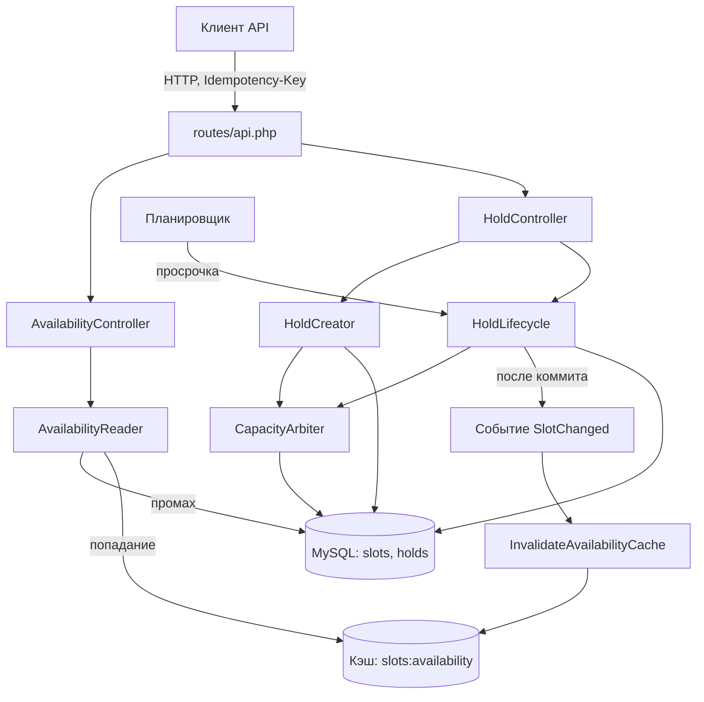

# Шаг 5. Схема архитектуры

- **Дата:** 2026-08-28
- **Статус:** согласовано
- **Метод:** «Head First. Архитектура ПО», гл. 9 (шаг 5 плана действий: физическое представление)

Физическое «приземление» логических компонентов (шаг 2) на уровни (шаг 3). Появляются БД, кэш, заданные из ТЗ классы и механизм инвалидации кэша.

---

## 1. Физическая схема

```
┌─ ВНЕШНИЙ МИР ───────────────────────────────────────────────────┐
│  Клиент API: curl, фронтенд                                     │
│  GET /slots/availability · POST /slots/{id}/hold                │
│  POST /holds/{id}/confirm · DELETE /holds/{id}                  │
└───────────────────────────┬─────────────────────────────────────┘
                            │ HTTP + Idempotency-Key (hold)
                            ▼
┌─ ПРЕДСТАВЛЕНИЕ ─────────────────────────────────────────────────┐
│  routes/api.php                                                 │
│  FormRequests: валидация UUID, ключа идемпотентности, 422       │
│  AvailabilityController ─┐                                      │
│  HoldController ─────────┼──► JsonResources: форма ответа       │
└──────────────┬───────────┴──────────────────────────────────────┘
               │ вызов
               ▼
┌─ РАБОЧИЙ ПРОЦЕСС ───────────────────────────────────────────────┐
│  app/Services — сервисный слой «SlotService» из ТЗ              │
│    ├─ AvailabilityReader — Витрина доступности                  │
│    │     чтение остатка, кэш 5–15 с, промах → БД                │
│    ├─ HoldCreator — Выдача удержаний                            │
│    │     идемпотентность: ровно один билет на ключ              │
│    ├─ CapacityArbiter — Арбитраж вместимости                    │
│    │     единственный, кто решает «есть ли место»               │
│    └─ HoldLifecycle — Жизненный цикл удержания                  │
│          машина состояний, транзакции                           │
│                                                                  │
│  Событие SlotChanged (после коммита)                            │
│    └─► InvalidateAvailabilityCache — сброс кэша доступности     │
│          (слушатель — часть Витрины, знание о кэше только у неё)│
└──────────────┬──────────────────────────────────────────────────┘
               │ чтение / запись
               ▼
┌─ ДАННЫЕ ────────────────────────────────────────────────────────┐
│  MySQL 8                                                       │
│    slots   — вместимость (неизменяемая конфигурация)            │
│    holds   — билеты: ключ, статус, срок годности                │
│  Кэш (Redis)                                                   │
│    slots:availability — только путь чтения (ADR 0004)          │
└─────────────────────────────────────────────────────────────────┘
```

## 2. То же в Mermaid



## 3. Потоки через уровни

| Сценарий | Цепочка | Данные |
|---|---|---|
| Показать доступность | AvailabilityController → AvailabilityReader | кэш при попадании, БД при промахе |
| Создать удержание | HoldController → HoldCreator → CapacityArbiter (проверка) | INSERT в holds; 409 при исчерпании |
| Подтвердить | HoldController → HoldLifecycle → CapacityArbiter (решение) | UPDATE статуса; после коммита → SlotChanged → сброс кэша |
| Отменить | HoldController → HoldLifecycle | UPDATE статуса; после коммита → SlotChanged → сброс кэша |
| Фон: сроки вышли | Планировщик → HoldLifecycle (просрочка) | UPDATE статуса просроченных |

## 4. Соответствия и ссылки

| Пункт схемы | Источник решения |
|---|---|
| Сервисный слой — каталог `app/Services`, класса `SlotService` нет | ADR 0005 |
| Кэш только на пути чтения | ADR 0004 |
| Сброс кэша событием после коммита, знание о кэше только у Витрины | ADR 0006 |
| Остаток вычисляется, в `slots` нет счётчика | ADR 0002 |
| Просрочка возвращает ничего — удержание не резервировало | ADR 0001 |
| Окно кэша 5–15 с: две фазы, защита от лавины в момент инвалидации | ADR 0007 |
